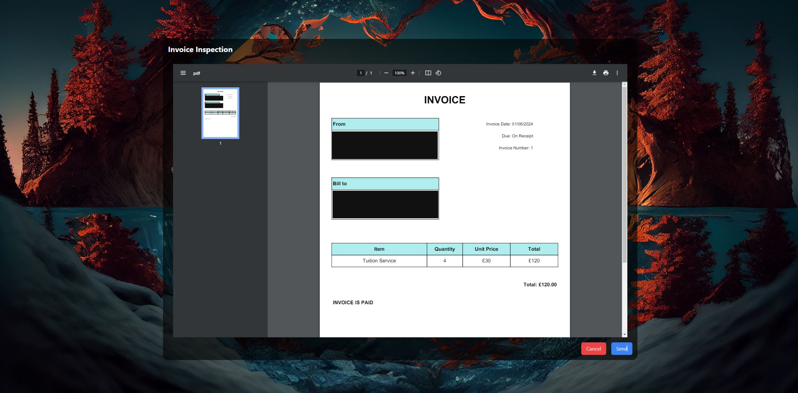

# Tutor Invoice Manager

Tutor Invoice Manager is a web application designed to help tutors manage their students' invoices efficiently. This application allows tutors to create, manage, and send invoices to their students. To achieve this I used Flask as my web framework. I then used HTMX and Tailwind on the frontend.

## Screenshots

<div id="slideshow">
        
    
    
</div>

## Features

- **Add**: Add new student profiles and invoices.
- **Remove**: Remove student profiles and invoices.
- **Edit**: Edit existing student profiles and invoices.
- **Create Invoice**: Generate invoices for individual students or groups.
- **Automatic Emailer**: Send email notifications for invoice status updates automatically.

## Getting Started

### Prerequisites

Before you begin, ensure you have the following installed:

- [Python](https://www.python.org/downloads/) (version X.X.X)
- [pip](https://pip.pypa.io/en/stable/installation/) (version X.X.X)
- [SQLite](https://sqlite.org/download.html) (or any other preferred database)

### Installation

1. **Clone the repository:**

    ```bash
    git clone https://github.com/yourusername/tutor-invoice-manager.git
    cd tutor-invoice-manager
    ```

2. **Create a virtual environment:**

    ```bash
    python -m venv venv
    source venv/bin/activate  # On Windows use `venv\Scripts\activate`
    ```

3. **Install dependencies:**

    ```bash
    pip install -r requirements.txt
    ```

4. **Set up environment variables:**
    1. Create a file called "sender_password.txt" 
    2. Insert your email password.
    3. This is used for the automated emailing

5. **Run database migrations (if applicable):**

    ```bash
    python manage.py migrate
    ```

6. **Start the application:**

    ```bash
    python app.py
    ```

    The application will run on `http://localhost:9000`.
